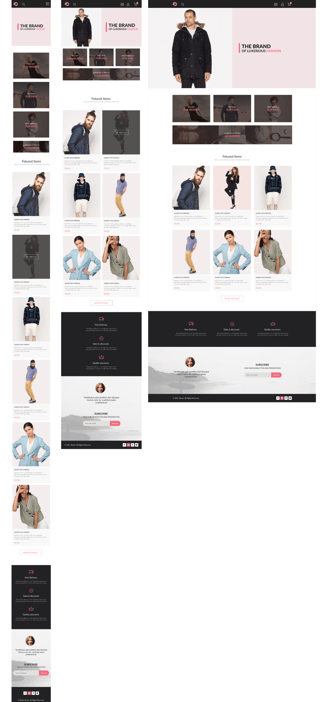

# $\color{palevioletred}\text{LUXERIOUS-FASHION V-2}$

$\color{limegreen}\text{Учебная работа}$

## $\color{mediumblue}\text{Описание работы }$:

Внешняя часть многостраничного сайта интернет магазина одежды.

Работа на основе домашних заданий по курсу GeekBrains , "Веб-вёрстка HTML/CSS -pro".

**Цели и задачи работы :**

❗Практика применения принципа разработки "Mobile first".

❗Использование и применение препроцессора SASS.

❗Изучение и применение БЭМ методологии.

❗Практика формирования блочной структуры страницы на основе макета figma.

❗Практика применения JS для создания отдельных динамических элементов на страницах.

❗Практическое применение семантических тегов и их использование.

❗Практическое применение CSS переменных.

🎯 Основная задача - Улучшение базовых навыков вёрстки.

---

Макет -> [**Figma**](https://www.figma.com/design/A0xDvMJEVjiET60WoasrkG/Shop-Layout?m=dev&node-id=0-1&t=wkwD9cKqTZeXTi5D-1)

Вёрстка -> [**Git pages**](https://artiom-work.github.io/LUXERIOUS-FASHION-v2/)

---

## $\color{mediumblue}\text{Технологии, инструменты и способы вёрстки }$:

❗ Mobile first
❗ БЭМ
❗ Семантика
❗ Адаптивная вёрстка
❗ Flex
❗ Grid
❗ SASS
❗ СSS Переменные
❗ Шаблонизация некоторых блоков с помощью JS

---

## $\color{mediumblue}\text{Темы , изучаемые в процессе работы над макетом :}$

📌 Grid. Новые возможности CSS 3.

📌 Семантические теги HTML5 . Формы. Типы полей ввода данных.

📌 Препроцессор SASS на практике.

📌 Эффекты перехода и трансформации.

📌 Практическое применение Bootstrap.

📌 БЭМ.

📌 Практическая вёрстка с макета с использованием : bootstrap, препроцессора БЭМ и других изученных способов вёрстки и технологий.

📌 PIXEL-Perfect на практике.
